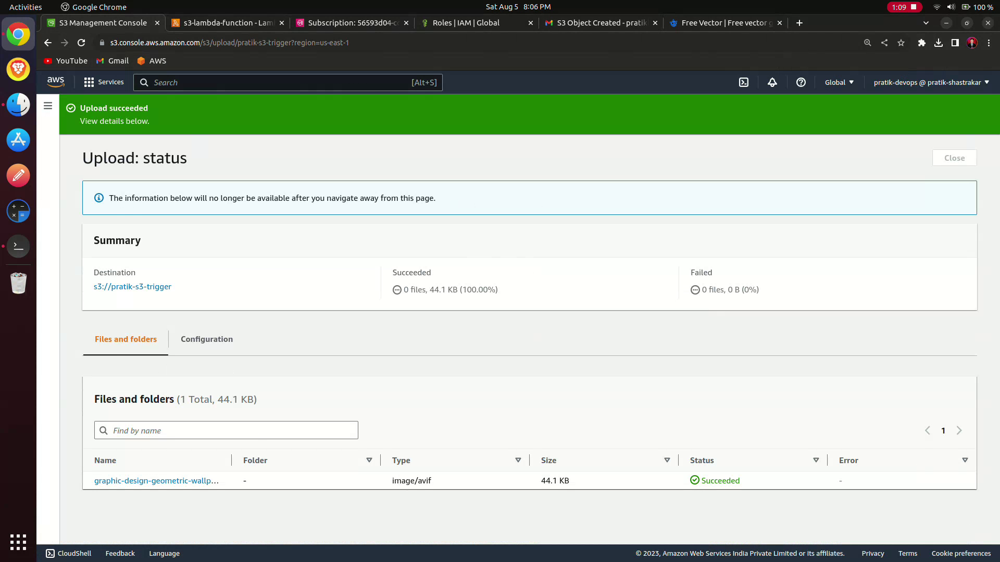
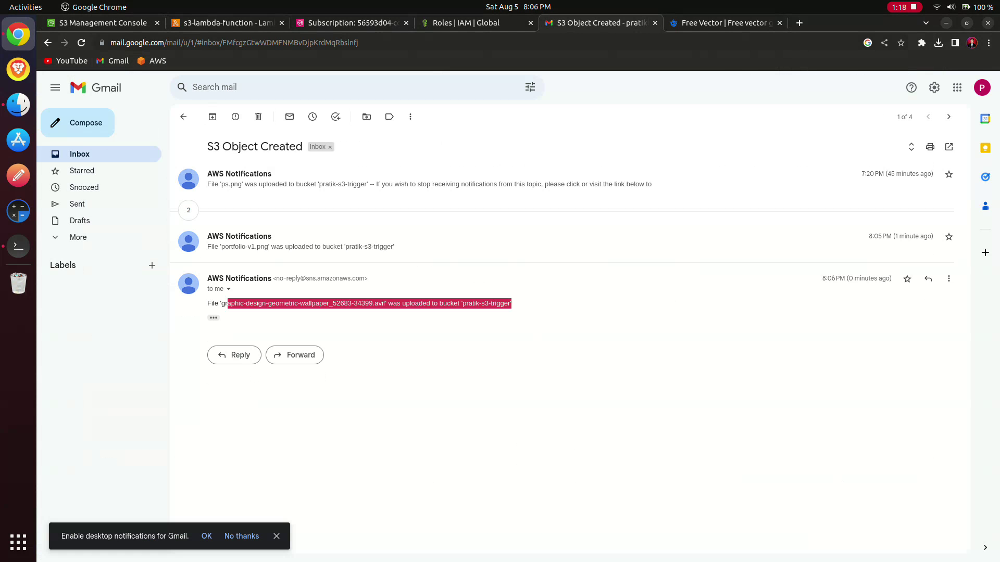

# Project Overview 🚀

The project automates the notification process for users whenever they upload something to an S3 bucket. This is achieved by using AWS Lambda, Amazon S3, Amazon SNS, and the `jq` command-line JSON processor. The Lambda function is written in Python.

## Project Components 📦

### S3 Bucket 🗄️

- A new S3 bucket is created to store the user uploads.

### Lambda Function 🐍

- The Lambda function is written in Python and serves as the event handler.
- It is triggered whenever a new object is uploaded to the S3 bucket.
- The function receives the event details, including the raw JSON data.

### `jq` JSON Processor 📑

- The Lambda function uses the `jq` command-line JSON processor to filter and extract only the necessary information from the raw JSON data.
- Specifically, it extracts the bucket and object names, removing any unwanted metadata.

### Amazon SNS Service 📧

- An Amazon SNS topic is set up to handle notifications.
- The Lambda function publishes the filtered notification content (bucket and object names) to this SNS topic.

### Email Notification 📬

- The Amazon SNS topic is configured to send email notifications to the users.
- Users' email IDs are subscribed to this topic to receive notifications.

## Workflow 🔄

1. User Uploads:
   - When a user uploads a file to the S3 bucket, an S3 event is triggered.

2. Lambda Function Execution:
   - The Lambda function is invoked in response to the S3 event.
   - It receives the raw event details in JSON format.

3. `jq` Processing:
   - The Lambda function uses the `jq` JSON processor to filter and extract the bucket and object names from the raw JSON data.

4. SNS Notification:
   - The Lambda function publishes the filtered notification content (bucket and object names) to the configured Amazon SNS topic.

5. Email Delivery:
   - Amazon SNS delivers the notification content to all subscribed users' email IDs.

## Advantages 👍

- Streamlined Data: The use of `jq` eliminates unnecessary data from the notification, ensuring that only essential information is sent to the users.
- Automation: The project automates the process of notifying users, reducing manual effort.
- Scalability: The architecture can handle a large number of users and file uploads.
- Cost-Effective: AWS Lambda's serverless nature ensures you only pay for the resources used during execution.
- Flexibility: The Python script in the Lambda function allows for easy customization and modification as per future requirements.

## Screenshots 📷

## Watch the project in action on YouTube 🎥

[Watch the demo on YouTube](https://www.youtube.com/watch?v=your-video-id)
